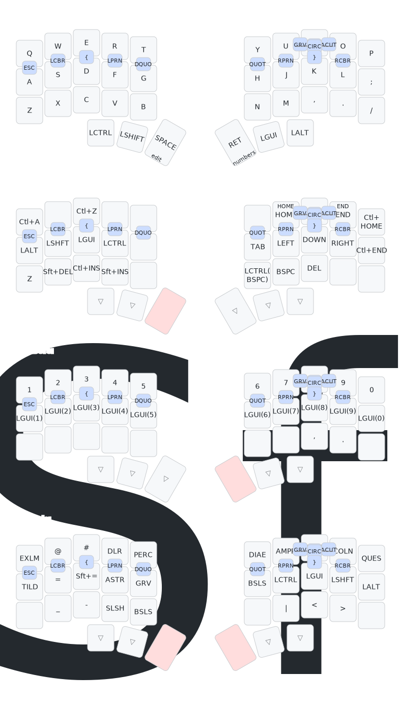

# Config for my ZMK powered Keyboards

This repo contains the config for my keyboard's firmware and builds it!

## Keymap

_Generated with [keymap-drawer](https://github.com/caksoylar/keymap-drawer)_

## References

### Firmware

[ZMK documentation](https://zmk.dev/docs)

### Layout

The initial approach was based on the [jcmkk3 layout](https://github.com/jcmkk3/zmk-config),
that I initially found in the [KeymapDB](https://keymapdb.com/keymaps/jcmkk3/).

## Instructions

I have the tendency of not using this keyboard for several months and having to re-learn a lot of stuff
when I get back to it.

For this purpose I will add a step-by-step for fleshing ZMK firmeware here:

1. Any push to this project will trigger the build.yml GithubAction
2. When this action run successfully a firmware.zip will be generated
3. Download this artifact and extract it, for split keyboards we will have a firmware for each half
4. Connect the keyboard via USB to the computer
5. Double press the reset button in the keyboard, this will enter bootloader mode
6. Select the device that appears as a USB in the OS and copy the left half firmware there
7. The device will automatically be unmonted and the new firmware will be active

[Docs for this process](https://zmk.dev/docs/user-setup#flashing-uf2-files)

If only the keymaps have been modified, flashing only the left half is enough
